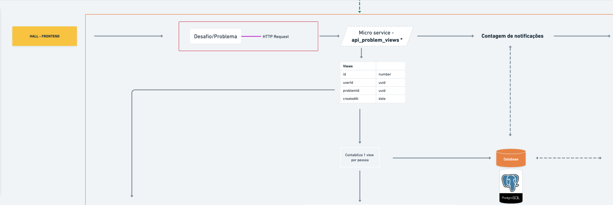

# Api problem views

## Motivação

- O objetivo deste serviço, é contabilizar visualizações de um desafio, e armazenar os dados para que o owner do problema seja notificado.

## Execução do projeto

- Para instalar os pacotes do projeto, utilize `npm i` ou `yarn`.
- Para executar o projeto, utilize `npm run dev` ou `yarn dev`.

## Migrations:

- Para criar uma novas migrations, executar o comando `npm run db:migration:create` + `nome da migration` ou `yarn db:migration:create` + `nome da migration`

  Exemplo: `npm run db:migration:create users`

## Docker

- Este projeto possui um dockerfile de configuração para executar o build.
- Caso necessário tambem está disponível um `docker-compose.yml`, onde instala todas as dependências necessárias para executar o projeto de forma local, como airflow e outras dependências externas.
- Para executar o `docker-compose.yml`, rodar o comando `docker-compose up -d`

## Tecnologias envolvidas no projeto:

[X] Express

[X] Sequelze

[X] Kafka

[X] Axios

[X] Typescript

[X] PostgreSQL

[X] Docker

[X] Airflow

## Fluxo da aplicação:

- veja o desenho completo <a target="_blank" href="https://whimsical.com/visualizacao-de-desafios-MVg88ZWFsbUZKrCghujBA">aqui</a>.
